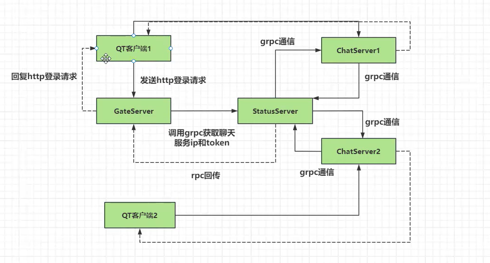

# 目录

- [目录](#目录)
  - [增加此功能后的项目结构图](#增加此功能后的项目结构图)
  - [StatusServer](#statusserver)
    - [作用](#作用)

## 增加此功能后的项目结构图 

## StatusServer

### 作用

- **负责负载均衡的作用**，此服务器可以根据不同的chatserver的连接数让新到的连接选择连接较少的来server连接
- **可以查状态，两个客户端并不是直接根据两个chatserver来通信，而是先通过statusserver来查询分别位于哪个服务器，在进行通信**
- **可以注册各个服务到此服务器中**

